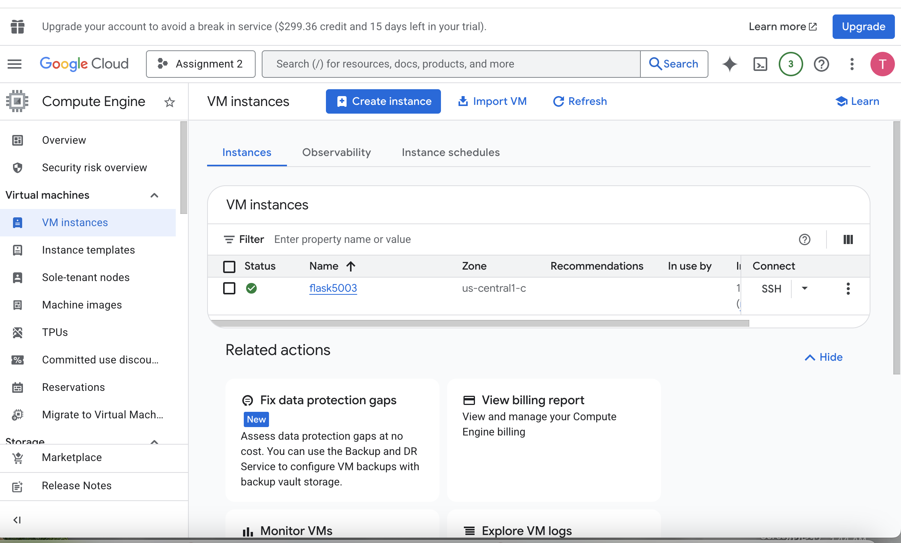
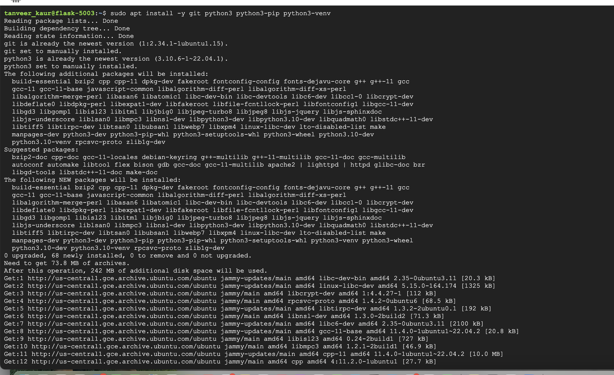
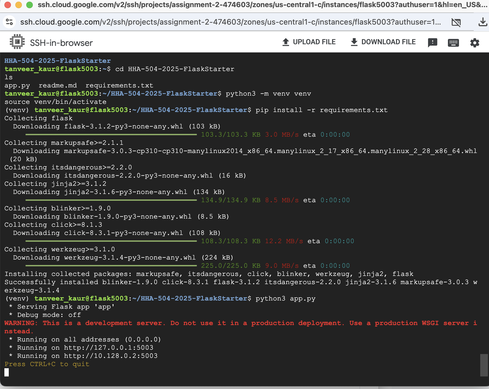
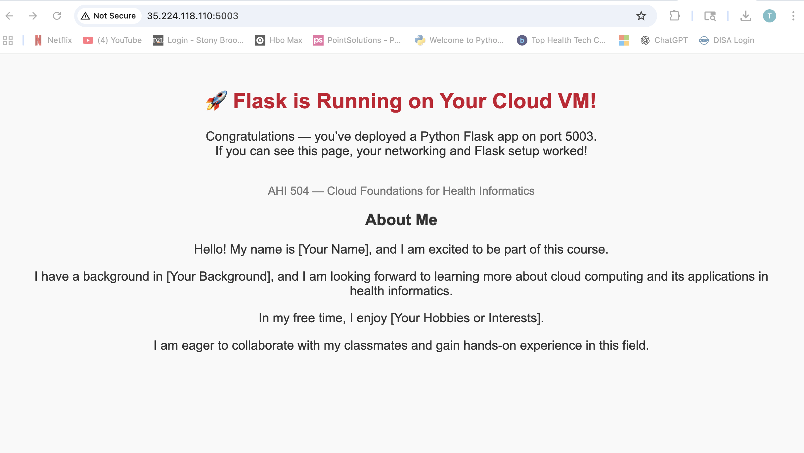

# Flask App Deployment on a Cloud VM (AHI 504 – Assignment 2)

## Student Information
**Name:** Tanveer Kaur  
**Cloud Provider:** Google Cloud Platform (GCP)  
**VM Name:** flask5003  

## Video Walkthrough
**Zoom / Loom Recording:**   
https://www.icloud.com/iclouddrive/089W8dfKsh9NZsOOg3Xw_2fNg#video2000574760
---

## Project Overview
This assignment demonstrates how to deploy a simple Flask web application on a Google Cloud virtual machine and expose it to the public internet using custom firewall rules. The project builds on VM lifecycle concepts and introduces networking configuration, Linux environment setup, and application hosting.

The Flask application is publicly accessible at: http://35.224.118.110:5003/

## Steps

### 1. VM Creation

### 2. Networking (Port 5003 Open) 

### 3. OS Update + Python Install 
- #### Commands
  - **Update OS:**  sudo apt update && sudo apt upgrade -y
  - **Insall Git, Python3 + pip:** sudo apt install git python3 python3-pip python3.13-venv -y

### 4. Flask App Running 

### 5. Public IP Access
- URL: http://35.224.118.110:5003/

